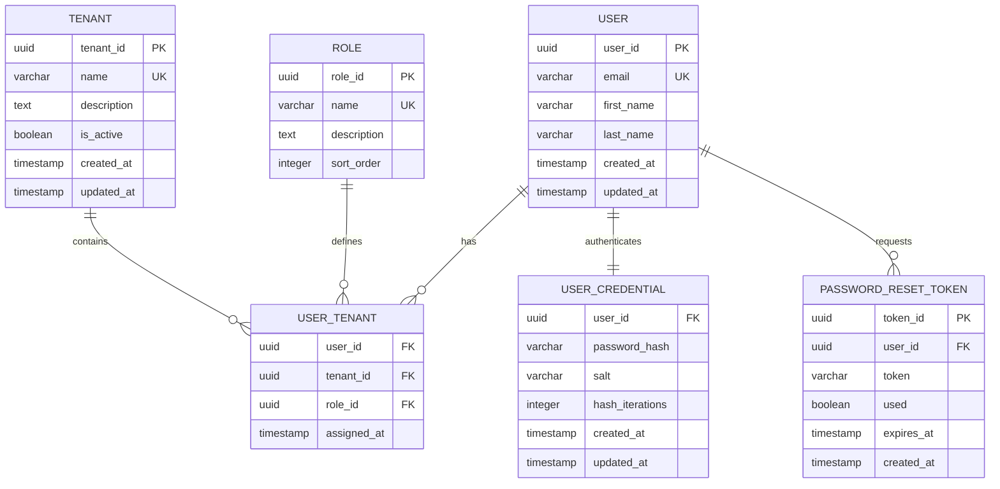

# Database Schema: Multi-Tenant RBAC

## Overview

This document describes the database schema for the multi-tenant role-based access control (RBAC) system in OpenCMS. The schema supports multiple organizations (tenants) with users having different roles within each tenant.

## Entity Relationship Diagram



## Table Definitions

### user
Primary entity for system users.

```sql
CREATE TABLE "user" (
    user_id UUID PRIMARY KEY DEFAULT gen_random_uuid(),
    email VARCHAR(255) NOT NULL UNIQUE,
    first_name VARCHAR(100),
    last_name VARCHAR(100),
    created_at TIMESTAMP NOT NULL DEFAULT CURRENT_TIMESTAMP,
    updated_at TIMESTAMP
);

-- Indexes
CREATE INDEX idx_user_email ON "user"(email);
CREATE INDEX idx_user_created_at ON "user"(created_at);
```

**Columns:**
- `user_id`: Unique identifier for the user
- `email`: User's email address (unique, used for login)
- `first_name`: User's first name (optional)
- `last_name`: User's last name (optional)
- `created_at`: When the user was created
- `updated_at`: When the user was last modified

### tenant
Represents organizations or entities within the system.

```sql
CREATE TABLE tenant (
    tenant_id UUID PRIMARY KEY DEFAULT gen_random_uuid(),
    name VARCHAR(255) NOT NULL UNIQUE,
    description TEXT,
    is_active BOOLEAN NOT NULL DEFAULT true,
    created_at TIMESTAMP NOT NULL DEFAULT CURRENT_TIMESTAMP,
    updated_at TIMESTAMP
);

-- Indexes
CREATE INDEX idx_tenant_name ON tenant(name);
CREATE INDEX idx_tenant_is_active ON tenant(is_active);
CREATE INDEX idx_tenant_created_at ON tenant(created_at);
```

**Columns:**
- `tenant_id`: Unique identifier for the tenant
- `name`: Display name for the tenant (unique)
- `description`: Optional description of the tenant
- `is_active`: Whether the tenant is currently active
- `created_at`: When the tenant was created
- `updated_at`: When the tenant was last modified

### role
Defines the available roles in the system.

```sql
CREATE TABLE role (
    role_id UUID PRIMARY KEY DEFAULT gen_random_uuid(),
    name VARCHAR(100) NOT NULL UNIQUE,
    description TEXT,
    sort_order INTEGER NOT NULL DEFAULT 0
);

-- Indexes
CREATE INDEX idx_role_name ON role(name);
CREATE INDEX idx_role_sort_order ON role(sort_order);
```

**Columns:**
- `role_id`: Unique identifier for the role
- `name`: Display name for the role (unique)
- `description`: Optional description of the role
- `sort_order`: Integer for ordering roles (lower = higher priority)

### user_tenant
Junction table linking users to tenants with specific roles.

```sql
CREATE TABLE user_tenant (
    user_id UUID NOT NULL,
    tenant_id UUID NOT NULL,
    role_id UUID NOT NULL,
    assigned_at TIMESTAMP NOT NULL DEFAULT CURRENT_TIMESTAMP,
    
    PRIMARY KEY (user_id, tenant_id),
    
    CONSTRAINT fk_user_tenant_user_id 
        FOREIGN KEY (user_id) REFERENCES "user"(user_id) ON DELETE CASCADE,
    CONSTRAINT fk_user_tenant_tenant_id 
        FOREIGN KEY (tenant_id) REFERENCES tenant(tenant_id) ON DELETE CASCADE,
    CONSTRAINT fk_user_tenant_role_id 
        FOREIGN KEY (role_id) REFERENCES role(role_id) ON DELETE RESTRICT
);

-- Indexes
CREATE INDEX idx_user_tenant_user_id ON user_tenant(user_id);
CREATE INDEX idx_user_tenant_tenant_id ON user_tenant(tenant_id);
CREATE INDEX idx_user_tenant_role_id ON user_tenant(role_id);
CREATE INDEX idx_user_tenant_assigned_at ON user_tenant(assigned_at);
```

**Columns:**
- `user_id`: Reference to the user
- `tenant_id`: Reference to the tenant
- `role_id`: Reference to the role
- `assigned_at`: When the role was assigned

**Constraints:**
- Primary key on (user_id, tenant_id) - users can have only one role per tenant
- Foreign key constraints with CASCADE delete for user/tenant, RESTRICT for role
- A user can have multiple roles across different tenants

### user_credential
Stores authentication credentials for users.

```sql
CREATE TABLE user_credential (
    user_id UUID PRIMARY KEY,
    password_hash VARCHAR(255) NOT NULL,
    salt VARCHAR(255) NOT NULL,
    hash_iterations INTEGER NOT NULL DEFAULT 10000,
    created_at TIMESTAMP NOT NULL DEFAULT CURRENT_TIMESTAMP,
    updated_at TIMESTAMP,
    
    CONSTRAINT fk_user_credential_user_id 
        FOREIGN KEY (user_id) REFERENCES "user"(user_id) ON DELETE CASCADE
);

-- Indexes
CREATE INDEX idx_user_credential_created_at ON user_credential(created_at);
```

**Columns:**
- `user_id`: Reference to the user (one-to-one relationship)
- `password_hash`: PBKDF2 hash of the user's password
- `salt`: Random salt used for password hashing
- `hash_iterations`: Number of iterations used in PBKDF2
- `created_at`: When the credential was created
- `updated_at`: When the credential was last modified

### password_reset_token
Stores tokens for password reset functionality.

```sql
CREATE TABLE password_reset_token (
    token_id UUID PRIMARY KEY DEFAULT gen_random_uuid(),
    user_id UUID NOT NULL,
    token VARCHAR(255) NOT NULL UNIQUE,
    used BOOLEAN NOT NULL DEFAULT false,
    expires_at TIMESTAMP NOT NULL,
    created_at TIMESTAMP NOT NULL DEFAULT CURRENT_TIMESTAMP,
    
    CONSTRAINT fk_password_reset_token_user_id 
        FOREIGN KEY (user_id) REFERENCES "user"(user_id) ON DELETE CASCADE
);

-- Indexes
CREATE INDEX idx_password_reset_token_user_id ON password_reset_token(user_id);
CREATE INDEX idx_password_reset_token_token ON password_reset_token(token);
CREATE INDEX idx_password_reset_token_expires_at ON password_reset_token(expires_at);
CREATE INDEX idx_password_reset_token_used ON password_reset_token(used);
```

**Columns:**
- `token_id`: Unique identifier for the token
- `user_id`: Reference to the user
- `token`: The actual reset token (unique)
- `used`: Whether the token has been used
- `expires_at`: When the token expires
- `created_at`: When the token was created

## Data Seeding

### Default Roles

```sql
INSERT INTO role (role_id, name, description, sort_order) VALUES
(gen_random_uuid(), 'Super User', 'System administrator with full platform access', 10),
(gen_random_uuid(), 'Administrator', 'Tenant administrator with user management capabilities', 20),
(gen_random_uuid(), 'Investigator', 'Case investigator with evidence management access', 30),
(gen_random_uuid(), 'Reviewer', 'Case reviewer with approval capabilities', 40),
(gen_random_uuid(), 'Reporter', 'Case reporter with basic submission capabilities', 50);
```

### Sample Tenant

```sql
INSERT INTO tenant (tenant_id, name, description, is_active) VALUES
(gen_random_uuid(), 'System Administration', 'Default tenant for system administration', true);
```

## Query Examples

### Get User with All Roles and Tenants

```sql
SELECT 
    u.user_id,
    u.email,
    u.first_name,
    u.last_name,
    t.tenant_id,
    t.name as tenant_name,
    r.role_id,
    r.name as role_name,
    ut.assigned_at
FROM "user" u
JOIN user_tenant ut ON u.user_id = ut.user_id
JOIN tenant t ON ut.tenant_id = t.tenant_id
JOIN role r ON ut.role_id = r.role_id
WHERE u.email = 'user@example.com'
ORDER BY r.sort_order;
```

### Get All Users in a Tenant

```sql
SELECT 
    u.email,
    u.first_name,
    u.last_name,
    r.name as role_name,
    ut.assigned_at
FROM "user" u
JOIN user_tenant ut ON u.user_id = ut.user_id
JOIN role r ON ut.role_id = r.role_id
WHERE ut.tenant_id = 'tenant-uuid-here'
ORDER BY r.sort_order, u.email;
```

### Get All Tenants Accessible by User

```sql
SELECT 
    t.tenant_id,
    t.name as tenant_name,
    t.description,
    r.name as role_name,
    ut.assigned_at
FROM tenant t
JOIN user_tenant ut ON t.tenant_id = ut.tenant_id
JOIN role r ON ut.role_id = r.role_id
JOIN "user" u ON ut.user_id = u.user_id
WHERE u.email = 'user@example.com'
  AND t.is_active = true
ORDER BY t.name;
```

### Check User Permission for Specific Tenant

```sql
SELECT EXISTS (
    SELECT 1 
    FROM "user" u
    JOIN user_tenant ut ON u.user_id = ut.user_id
    WHERE u.email = 'user@example.com'
      AND ut.tenant_id = 'tenant-uuid-here'
) as has_access;
```

### Get Users with Super User Role

```sql
SELECT 
    u.user_id,
    u.email,
    u.first_name,
    u.last_name
FROM "user" u
JOIN user_tenant ut ON u.user_id = ut.user_id
JOIN role r ON ut.role_id = r.role_id
WHERE r.name = 'Super User';
```

## Migration Scripts

### Adding RBAC to Existing System

If you're adding RBAC to an existing system, here's the migration sequence:

#### 1. Create New Tables

```sql
-- Create tenant table
CREATE TABLE tenant (
    tenant_id UUID PRIMARY KEY DEFAULT gen_random_uuid(),
    name VARCHAR(255) NOT NULL UNIQUE,
    description TEXT,
    is_active BOOLEAN NOT NULL DEFAULT true,
    created_at TIMESTAMP NOT NULL DEFAULT CURRENT_TIMESTAMP,
    updated_at TIMESTAMP
);

-- Create role table
CREATE TABLE role (
    role_id UUID PRIMARY KEY DEFAULT gen_random_uuid(),
    name VARCHAR(100) NOT NULL UNIQUE,
    description TEXT,
    sort_order INTEGER NOT NULL DEFAULT 0
);

-- Create user_tenant junction table
CREATE TABLE user_tenant (
    user_id UUID NOT NULL,
    tenant_id UUID NOT NULL,
    role_id UUID NOT NULL,
    assigned_at TIMESTAMP NOT NULL DEFAULT CURRENT_TIMESTAMP,
    
    PRIMARY KEY (user_id, tenant_id),
    
    CONSTRAINT fk_user_tenant_user_id 
        FOREIGN KEY (user_id) REFERENCES "user"(user_id) ON DELETE CASCADE,
    CONSTRAINT fk_user_tenant_tenant_id 
        FOREIGN KEY (tenant_id) REFERENCES tenant(tenant_id) ON DELETE CASCADE,
    CONSTRAINT fk_user_tenant_role_id 
        FOREIGN KEY (role_id) REFERENCES role(role_id) ON DELETE RESTRICT
);
```

#### 2. Seed Default Data

```sql
-- Insert default roles
INSERT INTO role (name, description, sort_order) VALUES
('Super User', 'System administrator with full platform access', 10),
('Administrator', 'Tenant administrator with user management capabilities', 20),
('Investigator', 'Case investigator with evidence management access', 30),
('Reviewer', 'Case reviewer with approval capabilities', 40),
('Reporter', 'Case reporter with basic submission capabilities', 50);

-- Insert default tenant
INSERT INTO tenant (name, description) VALUES
('Default Organization', 'Default tenant for existing users');
```

#### 3. Migrate Existing Users

```sql
-- Assuming you have an existing 'role' column in the user table
DO $$
DECLARE
    default_tenant_id UUID;
    role_mappings JSON := '{
        "admin": "Administrator",
        "investigator": "Investigator",
        "reviewer": "Reviewer",
        "reporter": "Reporter"
    }';
    user_record RECORD;
    role_id UUID;
BEGIN
    -- Get default tenant ID
    SELECT tenant_id INTO default_tenant_id 
    FROM tenant WHERE name = 'Default Organization';
    
    -- Migrate each user
    FOR user_record IN SELECT user_id, role FROM "user" WHERE role IS NOT NULL
    LOOP
        -- Get role ID based on mapping
        SELECT r.role_id INTO role_id
        FROM role r
        WHERE r.name = (role_mappings->user_record.role)::text;
        
        -- If no mapping found, default to Reporter
        IF role_id IS NULL THEN
            SELECT r.role_id INTO role_id
            FROM role r
            WHERE r.name = 'Reporter';
        END IF;
        
        -- Insert user-tenant-role relationship
        INSERT INTO user_tenant (user_id, tenant_id, role_id)
        VALUES (user_record.user_id, default_tenant_id, role_id);
    END LOOP;
END $$;
```

#### 4. Drop Old Role Column (if exists)

```sql
-- After verifying the migration worked correctly
ALTER TABLE "user" DROP COLUMN IF EXISTS role;
```

## Performance Considerations

### Indexing Strategy

The following indexes are recommended for optimal performance:

```sql
-- User table
CREATE INDEX idx_user_email ON "user"(email);
CREATE INDEX idx_user_created_at ON "user"(created_at);

-- Tenant table
CREATE INDEX idx_tenant_name ON tenant(name);
CREATE INDEX idx_tenant_is_active ON tenant(is_active);

-- Role table
CREATE INDEX idx_role_sort_order ON role(sort_order);

-- User-Tenant junction
CREATE INDEX idx_user_tenant_user_id ON user_tenant(user_id);
CREATE INDEX idx_user_tenant_tenant_id ON user_tenant(tenant_id);
CREATE INDEX idx_user_tenant_role_id ON user_tenant(role_id);

-- Composite index for common queries
CREATE INDEX idx_user_tenant_composite ON user_tenant(user_id, tenant_id, role_id);
```

### Query Optimization

For frequently accessed user permission data, consider:

1. **Materialized Views**: For complex permission calculations
2. **Caching**: Redis cache for user permissions
3. **Read Replicas**: For read-heavy permission checks

## Security Considerations

### Row-Level Security (RLS)

Consider implementing PostgreSQL Row-Level Security for additional protection:

```sql
-- Enable RLS on sensitive tables
ALTER TABLE tenant ENABLE ROW LEVEL SECURITY;

-- Create policy for tenant isolation
CREATE POLICY tenant_isolation ON tenant
    FOR ALL
    USING (tenant_id = current_setting('app.current_tenant_id')::UUID);
```

### Audit Trail

Consider adding audit columns to track changes:

```sql
-- Add audit columns to user_tenant
ALTER TABLE user_tenant ADD COLUMN created_by UUID;
ALTER TABLE user_tenant ADD COLUMN updated_by UUID;
ALTER TABLE user_tenant ADD COLUMN updated_at TIMESTAMP;
```

## Backup and Recovery

### Critical Data

The following tables contain critical RBAC data and should be prioritized in backups:

1. `user` - User accounts
2. `tenant` - Organization data
3. `role` - Role definitions
4. `user_tenant` - Permission assignments
5. `user_credential` - Authentication data

### Recovery Scenarios

#### Lost Role Assignments

```sql
-- Restore all users to Reporter role in default tenant
INSERT INTO user_tenant (user_id, tenant_id, role_id)
SELECT 
    u.user_id,
    (SELECT tenant_id FROM tenant WHERE name = 'Default Organization'),
    (SELECT role_id FROM role WHERE name = 'Reporter')
FROM "user" u
WHERE NOT EXISTS (
    SELECT 1 FROM user_tenant ut WHERE ut.user_id = u.user_id
);
```

#### Emergency Super User Access

```sql
-- Grant super user access to specific user for emergency access
INSERT INTO user_tenant (user_id, tenant_id, role_id)
VALUES (
    (SELECT user_id FROM "user" WHERE email = 'admin@yourcompany.com'),
    (SELECT tenant_id FROM tenant WHERE name = 'Default Organization'),
    (SELECT role_id FROM role WHERE name = 'Super User')
)
ON CONFLICT (user_id, tenant_id) DO UPDATE SET
    role_id = (SELECT role_id FROM role WHERE name = 'Super User');
```

---

*This schema documentation should be updated whenever the database structure changes.*
