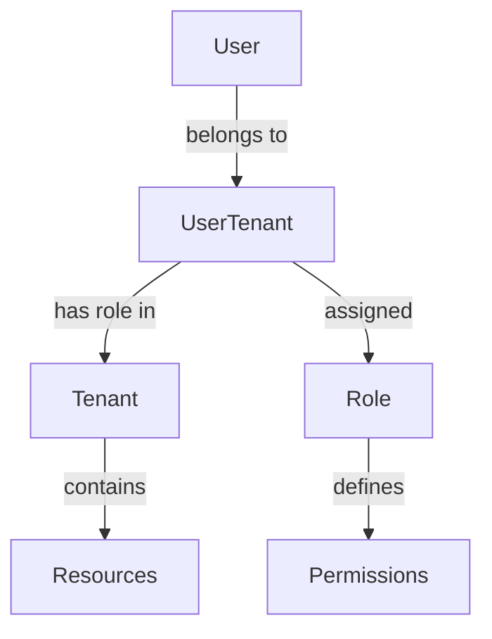
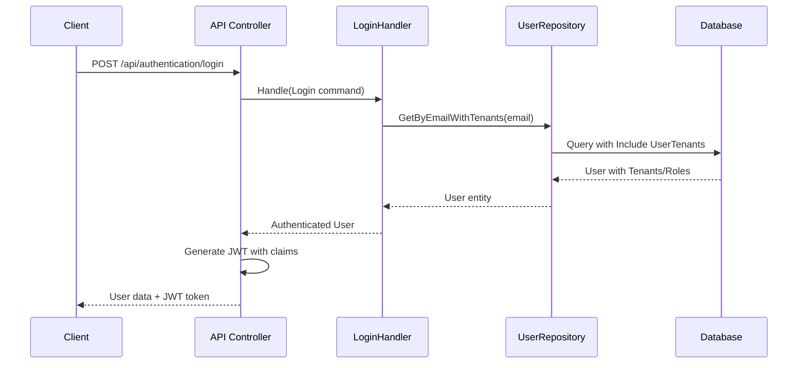

# Multi-Tenant Role-Based Access Control (RBAC) System

## Overview

The OpenCMS platform implements a sophisticated multi-tenant role-based access control system that allows users to have different roles within different organizations (tenants). This document provides a comprehensive guide to understanding, implementing, and maintaining the RBAC system.

## Table of Contents

1. [Architecture Overview](#architecture-overview)
2. [Domain Model](#domain-model)
3. [Database Schema](#database-schema)
4. [Authentication Flow](#authentication-flow)
5. [Frontend Integration](#frontend-integration)
6. [Role Hierarchy](#role-hierarchy)
7. [Implementation Examples](#implementation-examples)
8. [Security Considerations](#security-considerations)
9. [Troubleshooting](#troubleshooting)

## Architecture Overview

The RBAC system is built on three core principles:

1. **Multi-tenancy**: Users can belong to multiple organizations (tenants)
2. **Role-based access**: Each user has specific roles within each tenant
3. **Hierarchical permissions**: Roles have different levels of access and capabilities



## Domain Model

### Core Entities

#### User
The primary entity representing a system user.

```csharp
public class User
{
    public UserId UserId { get; private set; }
    public Email Email { get; private set; }
    public string? FirstName { get; private set; }
    public string? LastName { get; private set; }
    public UserCredential? Credential { get; private set; }
    public ICollection<UserTenant> UserTenants { get; private set; } = [];
    
    // Helper methods
    public string GetPrimaryRoleName()
    public bool HasAccessToTenant(TenantId tenantId)
    public bool IsSuperUser()
    public bool IsAdministrator()
}
```

#### Tenant
Represents an organization or entity within the system.

```csharp
public class Tenant
{
    public TenantId TenantId { get; private set; }
    public string Name { get; private set; }
    public string? Description { get; private set; }
    public bool IsActive { get; private set; }
    public DateTime CreatedAt { get; private set; }
    public DateTime? UpdatedAt { get; private set; }
}
```

#### Role
Defines the role types available in the system.

```csharp
public class Role
{
    public RoleId RoleId { get; private set; }
    public string Name { get; private set; }
    public string? Description { get; private set; }
    public int SortOrder { get; private set; }
    
    // Well-known roles
    public static class WellKnownRoles
    {
        public const string SuperUser = "Super User";
        public const string Administrator = "Administrator";
        public const string Investigator = "Investigator";
        public const string Reviewer = "Reviewer";
        public const string Reporter = "Reporter";
    }
}
```

#### UserTenant
Junction entity linking users to tenants with specific roles.

```csharp
public class UserTenant
{
    public UserId UserId { get; private set; }
    public TenantId TenantId { get; private set; }
    public RoleId RoleId { get; private set; }
    public DateTime AssignedAt { get; private set; }
    
    // Navigation properties
    public User User { get; private set; } = null!;
    public Tenant Tenant { get; private set; } = null!;
    public Role Role { get; private set; } = null!;
    
    // Helper methods
    public bool IsSuperUser()
    public bool IsAdministrator()
}
```

## Database Schema

### Tables

#### user
- `user_id` (UUID, Primary Key)
- `email` (VARCHAR, Unique)
- `first_name` (VARCHAR, Nullable)
- `last_name` (VARCHAR, Nullable)
- `created_at` (TIMESTAMP)
- `updated_at` (TIMESTAMP, Nullable)

#### tenant
- `tenant_id` (UUID, Primary Key)
- `name` (VARCHAR, Unique)
- `description` (TEXT, Nullable)
- `is_active` (BOOLEAN, Default: true)
- `created_at` (TIMESTAMP)
- `updated_at` (TIMESTAMP, Nullable)

#### role
- `role_id` (UUID, Primary Key)
- `name` (VARCHAR, Unique)
- `description` (TEXT, Nullable)
- `sort_order` (INTEGER)

#### user_tenant
- `user_id` (UUID, Foreign Key → user.user_id)
- `tenant_id` (UUID, Foreign Key → tenant.tenant_id)
- `role_id` (UUID, Foreign Key → role.role_id)
- `assigned_at` (TIMESTAMP)
- Primary Key: (user_id, tenant_id)

### Entity Framework Configuration

```csharp
// UserTenant composite key configuration
entity.HasKey(ut => new { ut.UserId, ut.TenantId });

// Foreign key relationships
entity.HasOne(ut => ut.User)
    .WithMany(u => u.UserTenants)
    .HasForeignKey(ut => ut.UserId);

entity.HasOne(ut => ut.Tenant)
    .WithMany()
    .HasForeignKey(ut => ut.TenantId);

entity.HasOne(ut => ut.Role)
    .WithMany()
    .HasForeignKey(ut => ut.RoleId);
```

## Authentication Flow

### 1. User Login


### 2. JWT Token Structure
```json
{
  "userId": "123e4567-e89b-12d3-a456-426614174000",
  "email": "user@example.com",
  "firstName": "John",
  "lastName": "Doe",
  "primaryRole": "Administrator",
  "role": ["Administrator", "Investigator"],
  "tenant": ["tenant-1", "tenant-2"],
  "exp": 1643723400
}
```

### 3. API Response Format
```json
{
  "userId": "123e4567-e89b-12d3-a456-426614174000",
  "email": "user@example.com",
  "firstName": "John",
  "lastName": "Doe",
  "primaryRole": "Administrator",
  "tenants": [
    {
      "tenantId": "tenant-1",
      "tenantName": "Acme Corporation",
      "roleName": "Administrator"
    },
    {
      "tenantId": "tenant-2",
      "tenantName": "Beta Industries",
      "roleName": "Investigator"
    }
  ],
  "token": "eyJhbGciOiJIUzI1NiIsInR5cCI6IkpXVCJ9..."
}
```

## Frontend Integration

### Redux State Management

#### Auth Slice Structure
```typescript
interface User {
    id: string;
    email: string;
    name: string;
    primaryRole: string;
    tenants: UserTenant[];
}

interface UserTenant {
    tenantId: string;
    tenantName: string;
    roleName: string;
}

interface AuthState {
    user: User | null;
    token: string | null;
    isAuthenticated: boolean;
    isLoading: boolean;
    error: string | null;
}
```

#### Role Checking Helper Functions
```typescript
// Check if user is a Super User
export const isSuperUser = (user: User | null): boolean => {
    return user?.primaryRole === 'Super User';
};

// Check if user is an Administrator or higher
export const isAdministrator = (user: User | null): boolean => {
    return user?.primaryRole === 'Administrator' || isSuperUser(user);
};

// Check if user has a specific role in any tenant
export const hasRole = (user: User | null, roleName: string): boolean => {
    if (!user) return false;
    return user.primaryRole === roleName || 
           user.tenants.some(t => t.roleName === roleName);
};

// Get tenants where user has a specific role
export const getTenantsByRole = (user: User | null, roleName: string): UserTenant[] => {
    if (!user) return [];
    return user.tenants.filter(t => t.roleName === roleName);
};
```

### Route Protection

#### Component Guards
```typescript
// Super User Guard
export const SuperUserGuard: React.FC<{ children: React.ReactNode }> = ({ children }) => {
    const user = useSelector(selectCurrentUser);
    
    if (!isSuperUser(user)) {
        return <Unauthorized message="Super User privileges required" />;
    }
    
    return <>{children}</>;
};

// Administrator Guard
export const AdminGuard: React.FC<{ children: React.ReactNode }> = ({ children }) => {
    const user = useSelector(selectCurrentUser);
    
    if (!isAdministrator(user)) {
        return <Unauthorized message="Administrator privileges required" />;
    }
    
    return <>{children}</>;
};
```

#### Smart Dashboard Routing
```typescript
export const SmartDashboard: React.FC = () => {
    const user = useSelector(selectCurrentUser);
    const navigate = useNavigate();

    useEffect(() => {
        if (isSuperUser(user)) {
            navigate('/super-user');
        } else if (isAdministrator(user)) {
            navigate('/admin');
        } else if (hasRole(user, 'Investigator')) {
            navigate('/investigator');
        } else if (hasRole(user, 'Reviewer')) {
            navigate('/reviewer');
        } else {
            navigate('/unauthorized');
        }
    }, [user, navigate]);
    
    return <LoadingSpinner message="Redirecting to your dashboard..." />;
};
```

## Role Hierarchy

The system implements a hierarchical role structure:

1. **Super User** (Highest privilege)
   - System-wide access
   - Can manage all tenants and users
   - Platform configuration access

2. **Administrator**
   - Tenant-level administrative access
   - User management within tenant
   - Category and case management

3. **Investigator**
   - Case investigation and management
   - Evidence handling
   - Report generation

4. **Reviewer**
   - Case review and approval
   - Quality assurance
   - Report validation

5. **Reporter** (Lowest privilege)
   - Case creation and submission
   - Basic case viewing
   - Limited editing capabilities

### Permission Matrix

| Feature | Super User | Administrator | Investigator | Reviewer | Reporter |
|---------|------------|---------------|--------------|----------|----------|
| Platform Settings | ✅ | ❌ | ❌ | ❌ | ❌ |
| Tenant Management | ✅ | ❌ | ❌ | ❌ | ❌ |
| User Management | ✅ | ✅* | ❌ | ❌ | ❌ |
| Case Management | ✅ | ✅ | ✅ | ✅** | ✅*** |
| Category Management | ✅ | ✅ | ❌ | ❌ | ❌ |
| Audit Logs | ✅ | ✅* | ❌ | ❌ | ❌ |

*Within tenant scope  
**Review and approval only  
***Create and basic edit only

## Implementation Examples

### Repository Usage
```csharp
// Load user with all tenant/role relationships
var user = await userRepository.GetByEmailWithTenants(email);

// Check user permissions
if (user.IsSuperUser())
{
    // Grant system-wide access
}
else if (user.HasAccessToTenant(tenantId))
{
    // Grant tenant-specific access
}
```

### API Controller Protection
```csharp
[HttpGet]
[Authorize]
public async Task<IActionResult> GetTenantData(Guid tenantId)
{
    var user = await GetCurrentUserWithTenants();
    
    if (!user.HasAccessToTenant(TenantId.From(tenantId)) && !user.IsSuperUser())
    {
        return Forbid("Access denied to this tenant");
    }
    
    // Process request
}
```

### Frontend Component Usage
```typescript
const TenantSelector: React.FC = () => {
    const user = useSelector(selectCurrentUser);
    
    if (isSuperUser(user)) {
        // Show all tenants
        return <AllTenantsDropdown />;
    }
    
    // Show only user's tenants
    const userTenants = user?.tenants || [];
    return <UserTenantsDropdown tenants={userTenants} />;
};
```

## Security Considerations

### 1. Token Security
- JWT tokens include role and tenant claims
- 30-minute expiration for security
- Secure token storage in frontend

### 2. Authorization Checks
- Always verify permissions on API endpoints
- Use guards for frontend route protection
- Implement defense in depth

### 3. Data Isolation
- Tenant data must be properly isolated
- Users can only access authorized tenant data
- Super Users have cross-tenant access

### 4. Role Validation
- Validate role assignments in database
- Ensure role hierarchy is respected
- Audit role changes

## Troubleshooting

### Common Issues

#### 1. User Can't Access Expected Features
**Symptoms**: User gets "Access Denied" errors
**Solutions**:
- Verify user has correct role in UserTenant table
- Check JWT token contains expected claims
- Ensure frontend role checking logic is correct

#### 2. Role Changes Not Reflected
**Symptoms**: User still has old permissions after role change
**Solutions**:
- User needs to log out and log back in
- JWT token needs to be refreshed
- Clear browser localStorage if needed

#### 3. Multi-Tenant Data Leakage
**Symptoms**: User sees data from wrong tenant
**Solutions**:
- Review API controllers for proper tenant filtering
- Ensure database queries include tenant restrictions
- Audit authorization middleware

### Debugging Tools

#### 1. JWT Token Inspection
```typescript
// Decode JWT token to inspect claims
const token = localStorage.getItem('token');
const decoded = JSON.parse(atob(token.split('.')[1]));
console.log('Token claims:', decoded);
```

#### 2. User Role Debugging
```typescript
// Log user's role information
console.log('User roles:', {
    primaryRole: user.primaryRole,
    tenants: user.tenants,
    isSuperUser: isSuperUser(user),
    isAdmin: isAdministrator(user)
});
```

#### 3. Database Query Verification
```sql
-- Check user's role assignments
SELECT u.email, t.name as tenant_name, r.name as role_name
FROM user u
JOIN user_tenant ut ON u.user_id = ut.user_id
JOIN tenant t ON ut.tenant_id = t.tenant_id
JOIN role r ON ut.role_id = r.role_id
WHERE u.email = 'user@example.com';
```

## Next Steps

1. **Implement Additional Guards**: Create guards for Administrator, Investigator, etc.
2. **Add Tenant Selection**: Allow users to switch between tenants they have access to
3. **Audit Trail**: Implement comprehensive audit logging for role changes
4. **Permission Caching**: Consider caching user permissions for performance
5. **Role Management UI**: Build administrative interface for managing user roles

---

*This documentation should be updated as the RBAC system evolves and new features are added.*
